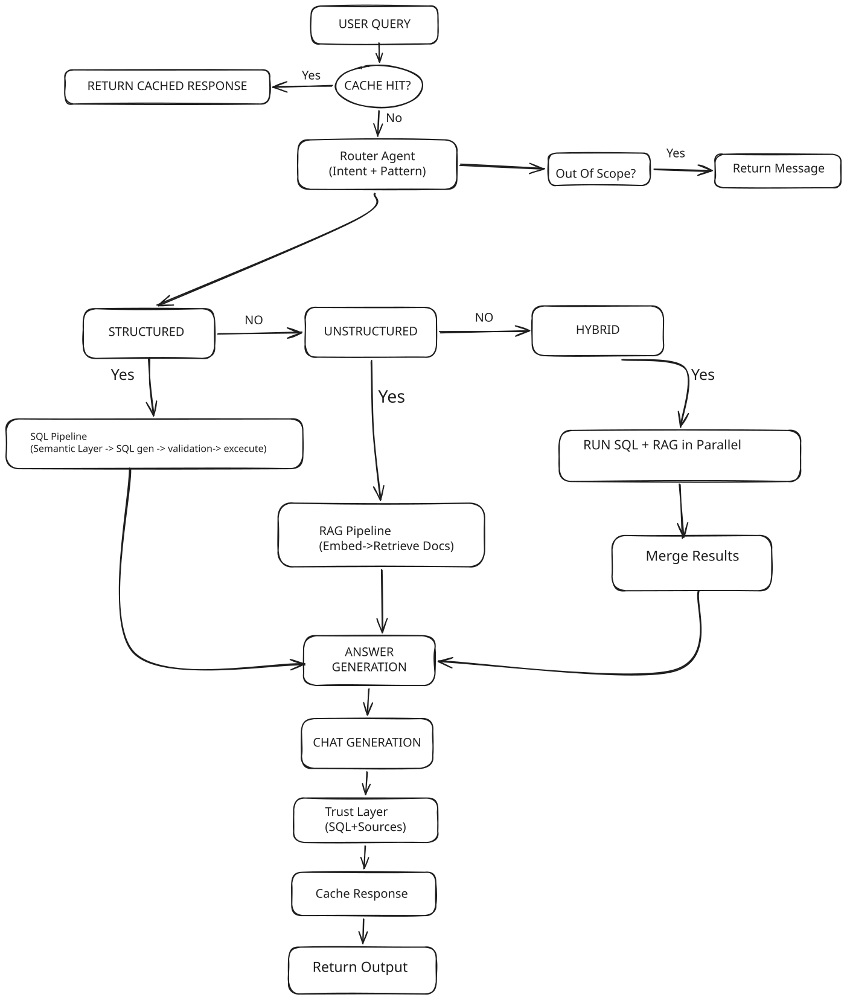
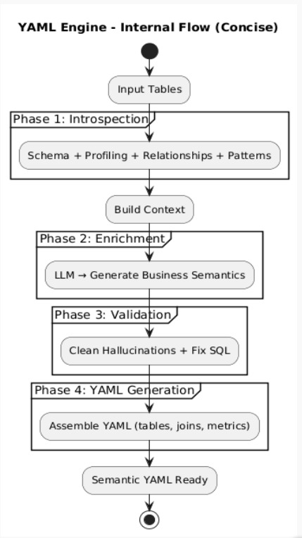

# 🗣️ Talk to Data — Multi-Agent AI Analytics Platform

> Ask questions about your data in plain English. Get instant, accurate answers with charts, insights, and full transparency — powered by a custom multi-agent AI pipeline.


---

## 📖 Overview

**Talk to Data** is a multi-agent AI system that enables non-technical users to query structured and unstructured data using natural language. Instead of writing SQL or navigating dashboards, users simply type a question — like *"Why did revenue drop in the South region?"* — and receive a clear, executive-friendly answer backed by auto-generated charts and transparent reasoning.

The system solves the problem of **data democratization in enterprises**: business analysts, managers, and executives often depend on data teams for insights. Talk to Data removes that bottleneck by translating plain English into accurate SQL, executing it against a database, and synthesizing the results into human-readable answers — all within seconds.

The intended users are **non-technical business stakeholders** (product managers, CXOs, operations leads) who need quick data-driven answers without learning SQL or BI tools.

---

## ✨ Features

### Core AI Pipeline
- **Multi-agent architecture** — Four specialized AI agents (Router → SQL Generator → Validator → Answer Generator) work in sequence to process each query with high accuracy.
- **Intent classification** — Automatically classifies questions into Structured (SQL), Unstructured (RAG), Hybrid (both), or Out-of-Scope categories.
- **Pattern-aware SQL generation** — Recognizes analytical patterns (Change Analysis, Comparison, Breakdown, Summary, General) and applies pattern-specific prompt templates for better SQL.
- **Self-healing SQL with retry** — If generated SQL fails validation (schema mismatch, syntax error), the system retries with error feedback for auto-correction.
- **SQL safety validation** — Schema whitelist checks and mutation blocking (only SELECT queries allowed) to prevent harmful operations.

### Semantic Intelligence
- **Semantic Layer (YAML-driven)** — A configurable semantic layer defines table schemas, metrics, filters, relationships, and aliases so the LLM generates contextually accurate SQL.
- **Few-shot retrieval** — Verified golden query pairs are embedded and retrieved via FAISS to guide the SQL generator with relevant examples.
- **Semantic caching** — Repeated or semantically similar questions are served from an embedding-based cache (~50ms response vs ~3s uncached).
- **RAG over documents** — Customer complaints and feedback documents are embedded in FAISS for vector search, enabling unstructured question answering.

### User Experience
- **Dual mode: Demo + Upload Your Own** — Use the built-in e-commerce dataset or upload CSV/Parquet files to query any dataset.
- **Auto-semantic profiling** — Uploaded files are automatically profiled (column types, value distributions, metrics, dimensions) and enriched via an LLM call to build query context on the fly.
- **Interactive Plotly charts** — Smart chart generation based on data shape and query pattern (bar, pie, line, grouped bar).
- **KPI metric cards** — Single-value results render as styled metric displays.
- **Follow-up suggestions** — Each answer includes 2–3 AI-generated follow-up questions for guided exploration.
- **Conversation memory** — Multi-turn support with conversation state tracking for contextual follow-ups.
- **Transparency panel** — Expandable "How I got this answer" section showing the SQL query, tables used, confidence score, and routing reasoning.
- **Premium dark UI** — A ChatGPT-inspired dark glassmorphism interface with smooth animations, built with React 19 + Framer Motion.

### Data Capabilities
- **DuckDB engine for uploads** — Uploaded files are queried via DuckDB (in-memory) for high-performance analytical queries without needing a database setup.
- **Pre-seeded demo dataset** — 2000+ orders, 200 customers, 50 products, and 300 complaints with a realistic e-commerce story (revenue drop in South region due to delivery issues).

---

## 🛠️ Install and Run Instructions

### Prerequisites

- **Python 3.10+**
- **Node.js 18+** and **npm**
- A free [Groq API key](https://console.groq.com/) (sign up and generate a key)

### 1. Clone the Repository

```bash
git clone https://github.com/VishardMehta/talk-to-data.git
cd talk-to-data
```

### 2. Backend Setup (Python)

```bash
# Create and activate a virtual environment
python -m venv venv

# Windows
venv\Scripts\activate

# macOS/Linux
source venv/bin/activate

# Install Python dependencies
pip install -r requirements.txt
```

### 3. Configure Environment Variables

```bash
# Copy the example env file and add your Groq API key
cp .env.example .env
```

Open `.env` and replace the placeholder with your actual Groq API key:

```
GROQ_API_KEY=gsk_your_actual_key_here
```

### 4. Seed the Demo Database

```bash
python data/seed.py
```

This generates `data/demo.db` with synthetic e-commerce data (orders, customers, products, complaints) and document files for RAG.

### 5. Run the Streamlit Backend

```bash
streamlit run app/main.py
```

The Streamlit app will open at **http://localhost:8501**.

### 6. (Optional) Run the React Frontend

If you want to use the premium React-based UI instead of the Streamlit interface:

```bash
cd frontend
npm install
npm run dev
```

The React frontend will start at **http://localhost:5173** and connects to the backend API at `http://localhost:8000`.

> **Note:** The Streamlit app (`app/main.py`) is the primary self-contained interface that works out of the box. The React frontend is an enhanced UI layer that requires the backend API to be running separately.

---

## 🧰 Tech Stack

| Layer | Technology | Purpose |
|---|---|---|
| **AI / LLM** | [Groq API](https://groq.com/) (free tier) | LLM inference — Llama 3.1 8B (routing) + Llama 3.3 70B (SQL gen, answers) |
| **Embeddings** | [sentence-transformers](https://www.sbert.net/) (`all-MiniLM-L6-v2`) | Semantic similarity for caching, RAG, and few-shot retrieval |
| **Vector Search** | [FAISS](https://github.com/facebookresearch/faiss) (in-memory) | Document index (RAG), schema index (table selection), verified query index |
| **Database** | SQLite (demo mode) | Structured data storage for the e-commerce demo dataset |
| **Database** | [DuckDB](https://duckdb.org/) (upload mode) | In-memory analytical queries on uploaded CSV/Parquet files |
| **Backend UI** | [Streamlit](https://streamlit.io/) | Primary chat interface with data visualization |
| **Charts** | [Plotly](https://plotly.com/python/) | Interactive chart rendering (bar, pie, line, grouped bar) |
| **Frontend** | React 19 + TypeScript + Vite | Premium dark-themed chat interface |
| **Frontend Styling** | TailwindCSS v4 + Framer Motion | Responsive design with micro-animations |
| **State Management** | [Zustand](https://zustand-demo.pmnd.rs/) | Lightweight client-side state |
| **UI Components** | Radix UI + Lucide Icons + Recharts | Accessible, composable primitives |
| **Config** | PyYAML | Semantic layer, pattern templates, verified queries — all YAML-driven |
| **Languages** | Python 3.10+, TypeScript | Backend intelligence + Frontend UI |

> **Design constraint:** No LangChain, no CrewAI, no agent frameworks. All agents are implemented as plain Python functions using raw Groq SDK calls.

---

## 🚀 Usage Examples

Once the app is running, try these questions in the chat:

### Structured Queries (SQL)

```
What is the total revenue?
```
→ Returns a single KPI metric card with the aggregate revenue figure.

```
Revenue by region
```
→ Returns a breakdown table + auto-generated bar chart showing revenue distribution across North, South, East, West.

```
Top 5 customers by spending
```
→ Returns a ranked table with customer names, segments, and total spend.

### Change Analysis

```
Why did revenue drop in March?
```
→ Identifies the South region as the primary contributor, explains the drop with percentage changes, and suggests follow-up questions.

### Comparisons

```
Compare North vs South region revenue
```
→ Side-by-side comparison with absolute values, percentage difference, and a grouped bar chart.

### Unstructured Queries (RAG)

```
What are customers complaining about?
```
→ Searches complaint documents via FAISS vector search and synthesizes key themes from the retrieved text.

### Hybrid Queries

```
Which region has the most complaints and what are the issues?
```
→ Combines SQL (complaint counts by region) with RAG (actual complaint text) for a comprehensive answer.

### Follow-ups

```
Now show me that by product category
```
→ Uses conversation state from the previous query to apply the same analysis with a different grouping dimension.

### Upload Mode

1. Switch to "Upload Your Own" in the sidebar.
2. Drop a CSV or Parquet file.
3. The system auto-profiles the data (column types, value ranges, suggested questions).
4. Ask questions like:

```
What is the average score by team?
Show the trend over time
Top 10 rows
```

### Sample Input/Output

**Input:** `"Compare online vs retail channel performance"`

**Output:**
> Online channel generated ₹12.4L in revenue from 820 orders (avg ₹1,512), while retail brought in ₹8.7L from 560 orders (avg ₹1,553). Retail has a slightly higher average order value despite lower volume.

*+ A grouped bar chart + data table + "How I got this" panel with the SQL query*

---

## 🏗️ Architecture

<p align="center">
  
  <br>
  <em>Multi-Agent Pipeline Architecture</em>
</p>

<p align="center">
  
  <br>
  <em>YAML Engine — Internal Flow: From input tables to a fully enriched semantic layer</em>
</p>

### Multi-Agent Query Pipeline

```
┌─────────────────────────────────────────────────────────────┐
│                      User Interface                         │
│         Streamlit (primary)  /  React + Vite (premium)      │
└────────────────────────┬────────────────────────────────────┘
                         │  User Question
                         ▼
┌─────────────────────────────────────────────────────────────┐
│                   Semantic Cache                            │
│   Embedding similarity check (threshold: 0.90)             │
│   Hit → return cached answer (~50ms)                       │
└────────────────────────┬────────────────────────────────────┘
                         │  Cache Miss
                         ▼
┌─────────────────────────────────────────────────────────────┐
│               Agent 1: Router (Llama 3.1 8B)               │
│   Classifies → intent (STRUCTURED | UNSTRUCTURED | HYBRID) │
│             → pattern (CHANGE_ANALYSIS | COMPARISON | ...)  │
└──────┬─────────────────┬──────────────────┬─────────────────┘
       │                 │                  │
  STRUCTURED          HYBRID          UNSTRUCTURED
       │                 │                  │
       ▼                 ▼                  ▼
┌──────────────┐  ┌─────────────┐  ┌──────────────────┐
│ Agent 2: SQL │  │  Both paths │  │  FAISS Document   │
│  Generator   │  │   execute   │  │  Search (RAG)     │
│ (Llama 3.3)  │  │             │  │  top-k retrieval  │
└──────┬───────┘  └──────┬──────┘  └────────┬─────────┘
       │                 │                   │
       ▼                 │                   │
┌──────────────┐         │                   │
│ Agent 3: SQL │         │                   │
│  Validator   │         │                   │
│ (Schema +    │         │                   │
│  Execute)    │         │                   │
└──────┬───────┘         │                   │
       │    Retry on     │                   │
       │    failure      │                   │
       ▼                 ▼                   │
┌─────────────────────────────────────────────────────────────┐
│          Agent 4: Answer Generator (Llama 3.3 70B)         │
│   Synthesizes: SQL results + RAG docs → plain English      │
│   Outputs: answer + chart suggestion + follow-up questions │
└─────────────────────────────────────────────────────────────┘
```

### Data Flow

```
User Question
  → Semantic Cache (check)
  → Router Agent (classify intent + pattern)
  → FAISS Schema Index (select relevant tables)
  → FAISS Verified Query Index (few-shot example)
  → SQL Generator (pattern-specific prompts + semantic layer context)
  → Validator (schema whitelist → safety check → execute → empty check)
  → Answer Generator (results + RAG docs → natural language + chart)
  → Semantic Cache (store)
  → UI (answer + chart + data table + follow-ups)
```

### Key Design Decisions

- **No agent frameworks** — Each agent is a plain Python function that calls the Groq API directly. This keeps the system simple, debuggable, and free of abstraction overhead.
- **Dual LLM strategy** — Llama 3.1 8B handles fast, simple tasks (routing) while Llama 3.3 70B handles complex reasoning (SQL generation, answer synthesis). This optimizes speed and cost within Groq's free tier limits.
- **YAML-driven configuration** — The semantic layer, query patterns, and verified queries are all defined in YAML files, making it easy to adapt the system to new datasets without changing code.
- **Graceful degradation** — The React frontend falls back to mock data if the backend is unavailable, and the upload pipeline falls back to raw data preview if SQL generation fails.

---

## ⚠️ Limitations

- **Groq free-tier rate limits** — Llama 3.3 70B is limited to ~30 requests/minute and ~1000 requests/day on the free tier. Each full query uses 2 LLM calls, capping throughput at ~500 queries/day.
- **SQLite date functions only** — The demo mode uses SQLite, which supports `date()`, `strftime()`, etc., but not `DATEADD`, `DATEDIFF`, or `NOW()`. Complex date calculations may occasionally produce incorrect SQL.
- **Single-user sessions** — The Streamlit app maintains state per browser session. There is no multi-user authentication or persistent session storage.
- **No real-time data** — The demo dataset is static (seeded). The upload mode supports file-based data only, not live database connections.
- **React frontend requires separate backend** — The premium React UI needs the FastAPI backend running independently; it does not work as a standalone app. The Streamlit interface is the fully self-contained option.
- **FAISS indexes are in-memory** — Vector indexes are rebuilt on each app restart. For the demo dataset size this is fast (~2–3 seconds), but would not scale to very large document corpora.

---

## 🔮 Future Improvements
- **Multi-file upload with join detection** — Upload multiple CSV and `.db` files; the system auto-detects common columns and suggests joins.
- **Currently supports CSV and `.db`** — other formats are not yet supported adn will be added later.
- **Persistent vector store** — Save FAISS indexes to disk to avoid re-indexing on every restart.
- **Live database connectors** — Support connecting to PostgreSQL, MySQL, or BigQuery for real-time querying.
- **Multi-user authentication** — Add user accounts with session isolation and query history.
- **Export & sharing** — Allow users to export answers, charts, and data tables as PDF or shareable links.
- **Fine-tuned models** — Fine-tune a smaller model on domain-specific SQL generation to reduce latency and improve accuracy.
- **Streaming answers** — Implement token-by-token streaming from the LLM to the UI for a more interactive experience (SSE infrastructure is already built in the React frontend).
- **Advanced visualizations** — Add heatmaps, scatter plots, and funnel charts based on richer chart suggestions from the answer agent.

---

## 📁 Folder Structure

```
talk-to-data/
├── app/                          # Backend application
│   ├── main.py                   # Streamlit chat UI + main pipeline
│   ├── theme.py                  # Custom CSS theme for Streamlit
│   ├── agents/                   # AI agent modules
│   │   ├── router.py             # Agent 1 — Intent & pattern classification
│   │   ├── sql_generator.py      # Agent 2 — SQL generation from natural language
│   │   ├── upload_sql_generator.py # SQL generation for uploaded files (DuckDB)
│   │   ├── validator.py          # Agent 3 — Schema validation + SQL execution
│   │   └── answer_generator.py   # Agent 4 — Natural language answer synthesis
│   ├── core/                     # Core infrastructure
│   │   ├── groq_client.py        # Shared Groq LLM client wrapper
│   │   ├── semantic_layer.py     # YAML-driven semantic layer loader
│   │   ├── vector_store.py       # FAISS indexes (documents, schema, queries)
│   │   ├── cache.py              # Embedding-based semantic cache
│   │   ├── state.py              # Conversation state management
│   │   ├── duckdb_engine.py      # DuckDB engine for upload mode
│   │   └── auto_semantic.py      # Auto-profiling + LLM enrichment for uploads
│   └── utils/                    # Utility modules
│       ├── sql_parser.py         # Regex-based SQL parsing (tables, columns)
│       └── chart_generator.py    # Smart Plotly chart generation
├── config/                       # YAML configuration
│   ├── semantic_layer.yaml       # Table schemas, metrics, filters, relationships
│   ├── verified_queries.yaml     # Golden question → SQL pairs for few-shot
│   └── pattern_templates.yaml    # Pattern-specific prompt templates
├── data/                         # Data layer
│   ├── seed.py                   # Database + document initialization script
│   ├── demo.db                   # SQLite demo database (generated by seed.py)
│   └── documents/                # RAG document collections
│       ├── complaints.json       # 100+ customer complaint records
│       └── feedback.json         # 50+ customer feedback records
├── frontend/                     # React premium UI (optional)
│   ├── src/
│   │   ├── pages/Dashboard.tsx   # Main chat page
│   │   ├── components/           # UI components (ChatMessage, Sidebar, etc.)
│   │   ├── store/useAppStore.ts  # Zustand state management
│   │   ├── lib/api.ts            # Backend API client with SSE streaming
│   │   └── types/index.ts        # TypeScript type definitions
│   ├── package.json
│   └── vite.config.ts
├── requirements.txt              # Python dependencies
├── .env.example                  # Environment variable template
├── .gitignore
└── README.md
```

---

## 🧪 Testing the Pipeline

After setup, verify the system works with these queries in order:

| # | Query | Expected Behavior |
|---|---|---|
| 1 | `What is the total revenue?` | Simple aggregate → KPI metric card |
| 2 | `Revenue by region` | Breakdown → table + bar chart |
| 3 | `Why did revenue drop in March?` | Change Analysis → identifies South region drop |
| 4 | `Compare North vs South` | Comparison → side-by-side values + chart |
| 5 | `What are customers complaining about?` | RAG → synthesized complaint themes |
| 6 | `Which region has most complaints and why?` | Hybrid → SQL counts + RAG text |
| 7 | `Give me a weekly summary` | Summary → multi-metric overview |
| 8 | `Now show me that by product` | Follow-up → uses conversation context |
| 9 | Repeat query #1 | Cache hit → ~50ms response with ⚡ badge |
| 10 | `What's the weather?` | Out-of-scope → graceful decline message |

---

## 📝 Technical Depth: Why These AI Choices?

### Multi-Agent Pipeline vs. Single-Prompt

A single LLM call to go from question → SQL → answer would be brittle and hard to debug. By decomposing the task into specialized agents, each step can be validated independently:

- The **Router** uses a smaller, faster model (8B) since intent classification is a simpler task.
- The **SQL Generator** uses the larger model (70B) with pattern-specific prompts and few-shot examples from verified queries — this dramatically improves SQL accuracy over zero-shot generation.
- The **Validator** is mostly deterministic code (no LLM), applying schema whitelist checks before expensive execution.
- The **Answer Generator** receives structured results and synthesizes them into natural language, separately from SQL generation — this separation of concerns prevents the LLM from "hallucinating" data.

### Semantic Layer for Grounding

The YAML semantic layer acts as a **grounding mechanism**: instead of letting the LLM guess table/column names, we inject enriched DDL with descriptions, sample values, valid relationships, and pre-defined metrics. This reduces hallucination and improves SQL correctness significantly.

### FAISS + Embeddings for Retrieval

We use the `all-MiniLM-L6-v2` embedding model (runs locally, no API cost) with FAISS for three retrieval tasks:
1. **Document search** — RAG over unstructured complaint/feedback text
2. **Table selection** — Find the most relevant tables for a given question
3. **Few-shot retrieval** — Find the closest verified query to use as an example

This provides context-aware behavior without fine-tuning the LLM.

---

*Built for the NatWest Code for Purpose — India Hackathon 2026*
